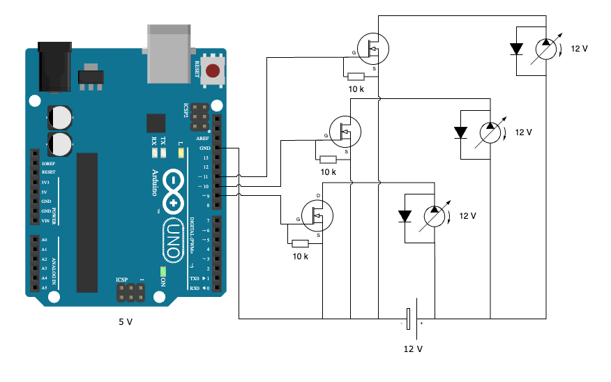

# Wiring

## Components

- 1x Arduino Uno R3
- 3x Water pump (12V)
- 3x MOSFET (TODO: Add type)
- 3x Resistor (10k Ohm)
- 3x Flyback diode

## Explanations

- Flyback diodes are needed, because the water pumps are inductive loads and can generate voltage spikes when turned off. The diodes are used to protect the MOSFETs from these spikes.
- The resistors are used to pull the gate of the MOSFET to ground when the Arduino is not driving the gate. This is to prevent the MOSFET from turning `on` when it should be `off`.

## Open questions

- Can the pumps actually be powered by the same 12 V power supply?
- What can be used to control the speed of the pumps? _PWM?_
- What can be used to measure the water level in the water tank?
