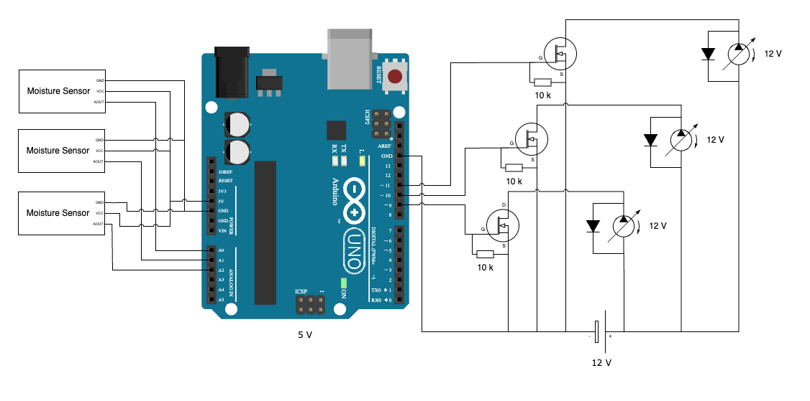

# Wiring

## Components

- 1x Arduino Uno R3
- 3x Water pump (12V)
- 3x MOSFET (N-Channel)
- 3x Resistor (10k Ohm)
- 3x Flyback diode
- Wires

## Explanations

- Flyback diodes are needed, because the water pumps are inductive loads and can generate voltage spikes when turned off. The diodes are used to protect the MOSFETs from these spikes.
- The resistors are used to pull the gate of the MOSFET to ground when the Arduino is not driving the gate. This is to prevent the MOSFET from turning `on` when it should be `off`.

## Open questions

- Can the pumps actually be powered by the same 12 V power supply?  
  -> Yes they can, as long as the power supply can provide enough current for all pumps.
- What can be used to control the speed of the pumps?  
  -> You can use PWM (Pulse Width Modulation) to control the speed of the pumps. However, be aware that the excess energy will be dissipated as heat.
- What can be used to measure the water level in the water tank?  
  -> There are a lot of different options to measure the water level in a tank. Some of the most common are ultrasonic sensors, float switches and capacitive liquid level sensors. The best option will depend on the specifications of the water tank and the requirements of the project. Mostly a small float switch will be enough to detect the water level in the tank.

## Hardware

### Moisture Sensor

Option 1.1: `Adafruit STEMMA Soil Sensor - I2C Capacitive Moisture Sensor - JST PH 2mm` [Adafruit](https://www.adafruit.com/product/4026) + `Kable` [Adafruit](https://www.adafruit.com/product/3955)

Option 1.2: `APKLVSR Capacitive Soil Moisture Sensor v1.2` [Amazon](https://www.amazon.de/dp/B0CQNF7S7L?ref=ppx_yo2ov_dt_b_fed_asin_title)

#### Test measures - Option 1.2

Air:

| Type     | Moisture Value 1 | Moisture Value 2 |
|----------|------------------|------------------|
| In Water | 11776            | _ToDo_           |
| At Air   | 27840            | _ToDo_           |

Coconut fibre:

| Type     | Moisture Value 1 | Moisture Value 2 |
|----------|------------------|------------------|
| Wet soil | 15168            | _ToDo_           |
| Dry soil | 22656            | _ToDo_           |

Plant soil:

| Type     | Moisture Value 1 | Moisture Value 2 |
|----------|------------------|------------------|
| Wet soil | 16064            | _ToDo_           |
| Dry soil | _ToDo_           | _ToDo_           |

### MOSFET

`FET STP60NF10, N-Channel, 100V, TO-220` [Pollin.de](https://www.pollin.de/p/fet-stp60nf10-n-cahnnel-100v-to-220-131022)

Key Specifications of STP60NF10:

- VDS (Drain-Source Voltage): 100V  
_This is much more than you need for your 12V circuit, so it provides a good safety margin._

- ID (Continuous Drain Current): 80A  
_This is far more than you need for your small water pumps. Having such a high current rating means the MOSFET will easily handle the startup surge of the pumps without overheating._

- Rds(on) (On-State Resistance): 0.019Ω  
_This is very low, meaning the MOSFET will have minimal resistance when it's on, leading to less heat and higher efficiency, especially when switching at high currents._

- Package: TO-220  
_The TO-220 package is common in power electronics and easy to work with for heatsinking if you need to dissipate any heat, but with your pump's lower current draw, you may not even need a heatsink._

### Pumps

> [!NOTE]
> The selection of the appropriate pump - be it a centrifugal pump, submersible pump, or self-priming pump - depends on it's planed installation location. Each type of pump has distinct requirements regarding the positioning of the tank and whether the hoses need to be primed with liquid. For instance a centrifugal pump needs to be primed with liquid before it can start pumping, while a submersible pump can be placed directly in the water.

#### Centrifugal Pump

Option 2.1: `Water pump 8-12 V-, 1,5 l/min.` [Pollin.de](https://www.pollin.de/p/wasserpumpe-8-12-v-1-5-l-min-330134)

Option 2.2: `Water pump 12 V-, 10 l/min.` [Pollin.de](https://www.pollin.de/p/wasserpumpe-12-v-10-l-min-330102)

### Flyback Diode

> [!IMPORTANT]
> Please be aware that depending on the pump you choose, you may need to adjust the flyback diode to match the pump's current rating.

For Option 2.1 Pumps: `1N5819` [Pollin.de](https://www.pollin.de/p/schottky-diode-1n5819-140731)

For Option 2.2 Pumps: `1N5822` [Pollin.de](https://www.pollin.de/p/schottky-diode-1n5822-3-a-40-v-936059)

### Power Supply (12V)

`SHNITPWR 12V Power Supply AC 100V ~ 240V to DC 12V 10A 120W` [Amazon](https://www.amazon.de/gp/product/B08XWJFGFB/ref=ppx_yo_dt_b_asin_title_o00_s00?ie=UTF8&psc=1)

This should be enough for both pump options.

- For 6x Option 2.1 pumps, the total current draw is only `2.1A` _( 6 × 350mA = 2.1A)_, which is well within the `6.25A` capability of this power supply.
- For 3x Option 2.2 pumps, the total current draw is `5.4A` _(3 × 1.8A = 5.4A)_, also safely within the power supply’s capacity.

### Ultrasonic Sensors

`Fdit 5V water proof ultrasonic sensor (Fdith9obv7uqge)` [Amazon](https://www.amazon.de/dp/B07N5GHZVX?ref=ppx_yo2ov_dt_b_fed_asin_title)
